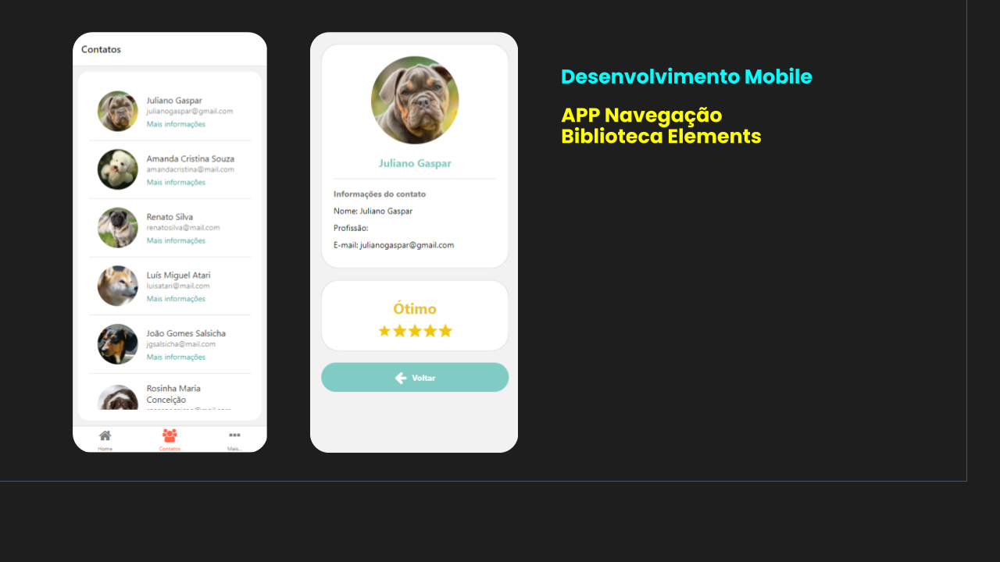

# App Navegação com Biblioteca Elements
Projeto com exemplo de navegação com React-Native e utilizando a biblioteca de Elements com componentes de interface.
Projeto criado no contexto da disciplina de desenvolvimento mobile.

## Assuntos abordados

- React Native
- Expo
- React Navigation
- Navigation Stack
- Navigation Tabs
- Navigation Drawer
- Routes
- React Native Elements